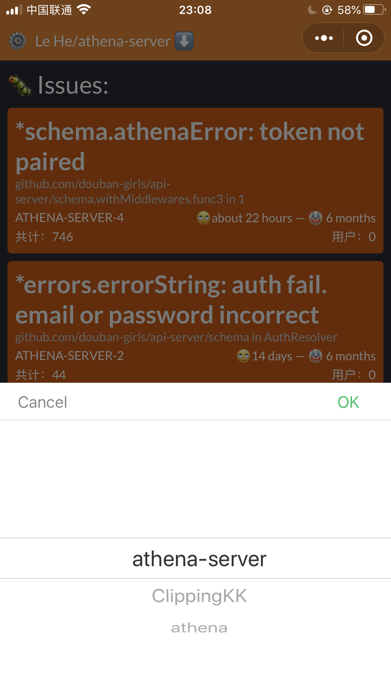
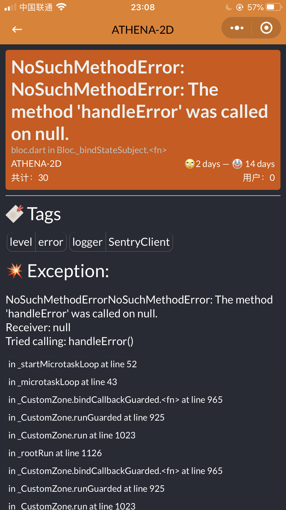

# sentry mp client (NOT sdk)

sentry 小程序客户端，方便查看最新的 bug

## 背景

线上有 bug，但是根据 “线上有 bug” 这么一段话怎么判断出到底是真的有问题还有谁在瞎 bb。大冬天的也不想起床开电脑查报错。所以这个小程序诞生了（虽然你可能一点儿都不想用）

它的主要目的是不用打开电脑就能看到一些 sentry 报错信息。做一些简单的预判断。同时支持转发给同事，如果你判断出某位同事负责这部分代码可以直接转发了。

功能比较简单，仅仅是胜在方便。

## 使用

首先您需要在 [sentry.io](https://sentry.io/settings/account/api/auth-tokens/) 中创建一个 token，放心，这个小程序只有非常基础的打点功能，你的 token 只保存在本地，这个小程序任何授权都不需要。

将 token 贴入到页面的输入框中（初次打开即会弹出）

成功可以看到您的所有项目列表，首页默认展示第一个项目。通过点击项目即可实现切换

点击可进入详情，简单看一下堆栈信息

如果不是你的 bug 你可以选择转发给其他人处理，或者你拿起电脑来处理。（其实是方便老板直接转发到开发群）

## 其他使用相关问题

由于微信的请求域名限制问题。sentry.io 被国内域名代理了一层。对被代理不放心或者是私有部署 sentry 服务的，可以考虑自行发布项目，需要做的只是修改 `.env` 文件中的 `REMAX_APP_ENDPOINTS` 环境变量。

或者图方便也可以直接联系 `@AnnatarHe` 来将您的域名加入到项目后台中。

## 开发相关

拿着 [remax](https://github.com/remaxjs/remax) 试着写着玩，花了几天时间。数据管理 redux & redux-saga。ajax 使用自带的 `wx.request`

界面设计上惨不忍睹，哪位设计朋友实在看不下去了可以给我发设计稿。

## 最后的其他

有什么问题可以直接发 issue，代码看不顺眼也可以提 pull request，项目感兴趣可以直接拿去 fork。

不需要去读什么提问的智慧，如何正确问问题。我也不会用书面语含糊其辞地敷衍。

总之这就是个图方便的项目，没什么技术含量。硬要说有那些好的地方的话，我觉得代码写得还蛮好看的，结构也比较简单，新手接到应该很快就能上手。
